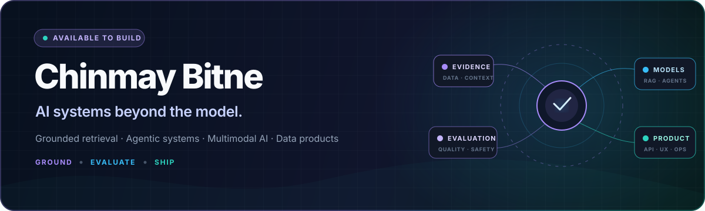
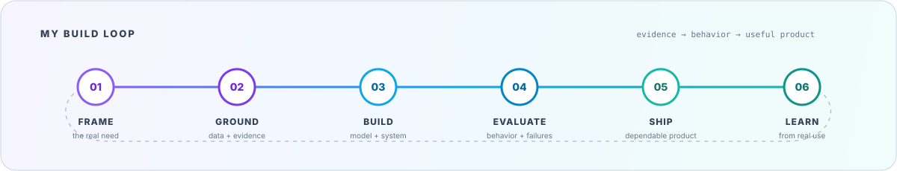
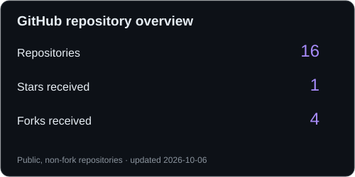
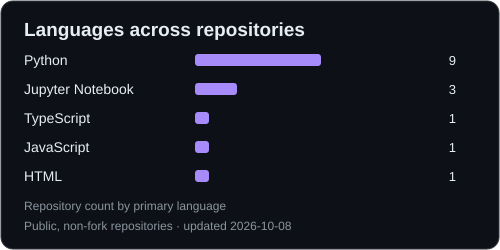

<div align="center">

<a href="https://chinmaybitne.github.io/">
  
</a>

<br />

[](https://chinmaybitne.github.io/)
[](https://www.linkedin.com/in/chinmaybitne/)
[](mailto:chinmaybitne82@gmail.com)

**AI/ML Engineer · Data Scientist · Applied AI Builder**<br />
Tempe, Arizona · Open to new opportunities

</div>

## Hello — I'm Chinmay

I build AI systems that stay useful beyond the demo: grounded retrieval, explicit agent boundaries, measurable evaluation, dependable APIs, and product experiences people can trust.

My work moves between **RAG and agentic AI**, **multimodal and computer-vision systems**, and **analytics that turn messy signals into decisions**. I recently completed an M.S. in Information Technology at Arizona State University with a 4.00 GPA and distinction.



## Selected builds

<table>
  <tr>
    <td width="50%" valign="top">
      <h3>🌿 <a href="https://github.com/ChinmayBitne/Answerleaf-AI">AnswerLeaf AI</a></h3>
      <p><strong>Grounded academic research workspace</strong></p>
      <p>Turns class materials and student-approved web evidence into assignment-ready work with inspectable citations.</p>
      <p><code>Next.js</code> <code>FastAPI</code> <code>LangGraph</code> <code>PostgreSQL</code> <code>pgvector</code></p>
      <p><a href="https://answerleaf-ai-web-nine.vercel.app/">Live product ↗</a> · <a href="https://chinmaybitne.github.io/projects/answerleaf/">Case study ↗</a></p>
    </td>
    <td width="50%" valign="top">
      <h3>✦ <a href="https://github.com/ChinmayBitne/ASTRA-AI">ASTRA AI</a></h3>
      <p><strong>Open-source, voice-first Windows desktop beta</strong></p>
      <p>Uses Gemini Live and 50+ local tools for real-time conversation, desktop automation, system awareness, and multi-step workflows.</p>
      <p><code>Electron</code> <code>React</code> <code>TypeScript</code> <code>Gemini Live</code> <code>Express</code></p>
      <p><a href="https://github.com/ChinmayBitne/ASTRA-AI">Source ↗</a> · <a href="https://chinmaybitne.github.io/projects/astra/">Case study ↗</a></p>
    </td>
  </tr>
  <tr>
    <td width="50%" valign="top">
      <h3>🛣️ <a href="https://github.com/ChinmayBitne/LDWS-and-Object-Detection">LDWS & Object Detection</a></h3>
      <p><strong>Computer-vision driving-assistance prototype</strong></p>
      <p>Coordinates lane detection, object detection, distance estimation, and visible collision warnings for constrained hardware.</p>
      <p><code>Python</code> <code>YOLO</code> <code>OpenCV</code> <code>ONNX</code> <code>TensorRT</code></p>
      <p><a href="https://chinmaybitne.github.io/projects/ldws/">Case study ↗</a></p>
    </td>
    <td width="50%" valign="top">
      <h3>🥗 <a href="https://github.com/ChinmayBitne/NutriAssist-AI">NutriAssist AI</a></h3>
      <p><strong>Local-first multimodal nutrition assistant</strong></p>
      <p>Combines fine-tuned language models, grounded nutrition data, meal tracking, memory, and food-image understanding.</p>
      <p><code>Qwen</code> <code>LoRA/PEFT</code> <code>Python</code> <code>Streamlit</code> <code>Docker</code></p>
      <p><a href="https://chinmaybitne.github.io/projects/nutriassist/">Case study ↗</a></p>
    </td>
  </tr>
</table>

## GitHub analytics

<div align="center">

<a href="https://github.com/ChinmayBitne?tab=repositories">
  
</a>
<a href="https://github.com/ChinmayBitne?tab=repositories">
  
</a>

</div>

<sub>Repository-hosted snapshots refreshed daily. Counts cover owned public repositories, excluding forks. Languages reflect repository counts by primary language, not proficiency or code volume.</sub>

## How I work

```text
01  Start with the real decision or user need
02  Ground the system in inspectable data and evidence
03  Make model and agent boundaries explicit
04  Evaluate behavior, including failure cases
05  Ship the smallest dependable product — then learn from use
```

## Toolkit

<div align="center">


</div>

**AI:** RAG · agents · NLP · multimodal AI · computer vision · fine-tuning · model evaluation<br />
**Data:** SQL · predictive modeling · ETL · Tableau · Power BI · data storytelling<br />
**Delivery:** APIs · relational databases · cloud deployment · CI/CD · testing

## Current signal

- Building grounded AI products where every answer can be traced back to evidence.
- Exploring voice-first agents, local tool execution, and clear confirmation for consequential actions.
- Open to AI/ML engineering and applied-AI opportunities where rigorous engineering and product thinking both matter.

<div align="center">

### Let’s build something useful.

[View the portfolio](https://chinmaybitne.github.io/) · [Explore the repositories](https://github.com/ChinmayBitne?tab=repositories) · [Connect on LinkedIn](https://www.linkedin.com/in/chinmaybitne/)

<sub>Ground the system · Measure the behavior · Ship with intent</sub>

</div>
